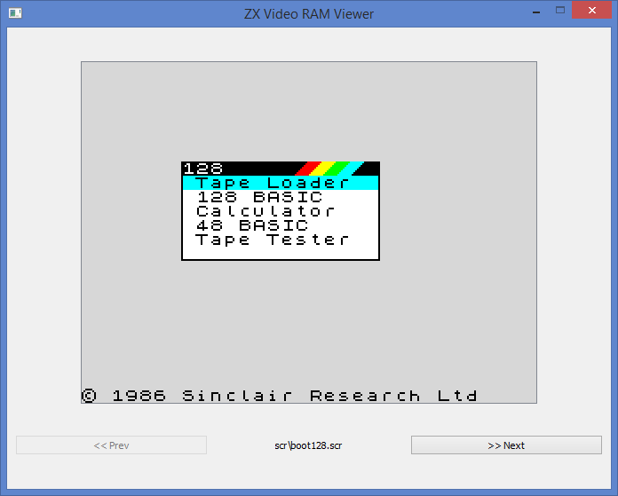
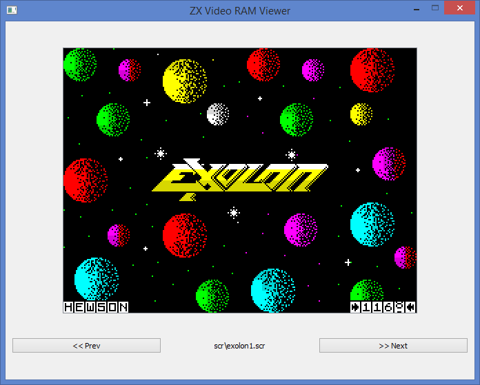
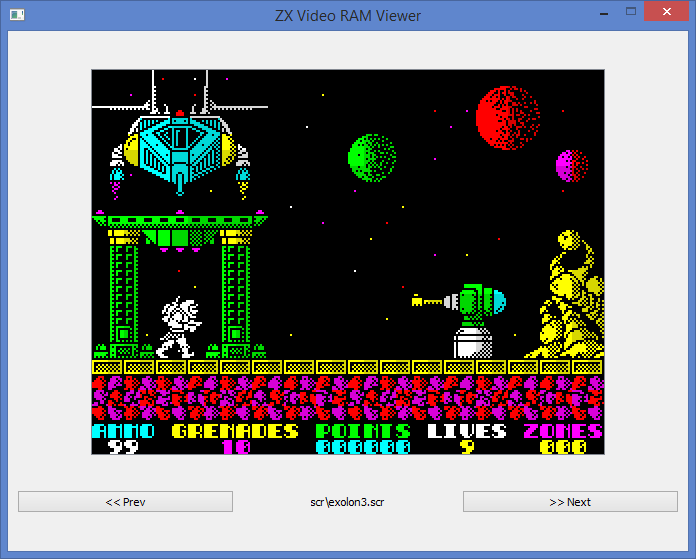
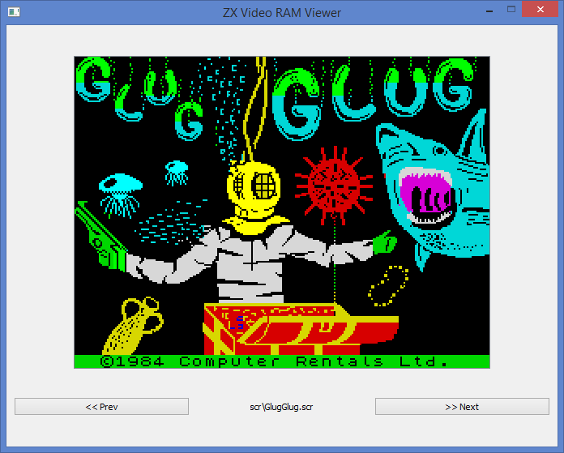
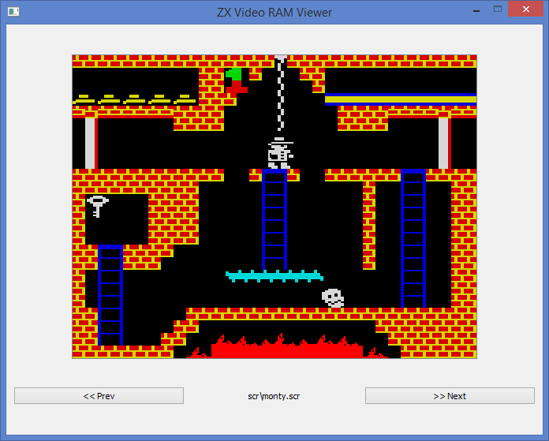
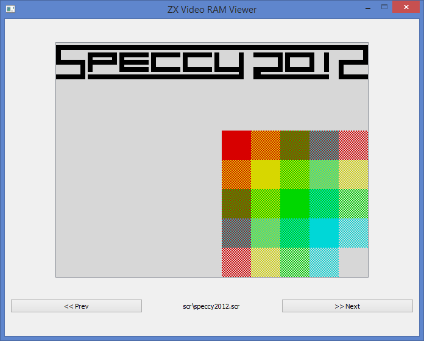

# <b>ZX Spectrum .scr files viewer</b>

.scr file - ZX Spectrum Video RAM snapshoot

<b>File content</b> 
* 6144 bytes worth of bitmap data 
* 768 byte colour attribute data 

<b>ZX Video RAM</b>
    
    Starting at memory address &4000

    Attributes area immediately after the bitmap data at address &5800

    Screen resolution       256 x 192, 8x8 cells, 32 bytes / line

    Region size             64 line / 64*32 = 2048 bytes

    Memory region 0         Lines 0 -  63

    Memory region 1         Lines 64 - 127

    Memory region 2         Lines 128 - 191

    Attr region size        32 bytes / 8 lines

 
 

(C) 2020 electronic-lviv

